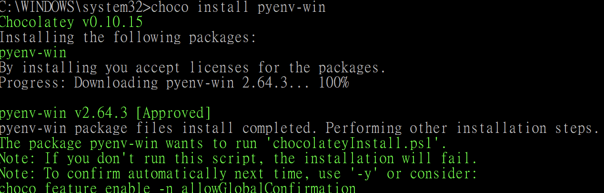
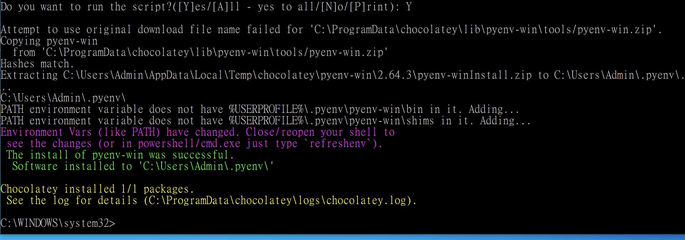

# Windows 開發環境安裝

### Windows 安裝順序：
choco → pyenv-win → Python → pip → paramiko

choco = chocolatey

# chocolatey 說明
在過去在 Windows 安裝軟體應用程式時，需要下載安裝檔與使用其軟體安裝流程步驟等各種 GUI 介面，如果需要安裝多個軟體時使用上很繁瑣，Chocolatey 是在 Windows 上的套件管理工具，它結合 Nuget 基礎服務與 powershell 指令，提供快速安裝應用程式與需要工具的服務，主要是將安裝軟體的內容封裝到一個安裝包中，在 Chocolatey 中只需要一條簡單的 command line，就可以完成搜尋、安裝、更新、解安裝等操作

# 安裝 chocolatey 吧 [https://chocolatey.org/](https://chocolatey.org/)
使用 cmd.exe 
使用系統管理員身份執行命令提示字元
``` Shell
@"%SystemRoot%\System32\WindowsPowerShell\v1.0\powershell.exe" -NoProfile -InputFormat None -ExecutionPolicy Bypass -Command "iex ((New-Object System.Net.WebClient).DownloadString('https://chocolatey.org/install.ps1'))" && SET "PATH=%PATH%;%ALLUSERSPROFILE%\chocolatey\bin"
```

## 確認安裝完成
安裝完畢之後，可以透過 choco 指令確認是否安裝完成
```Shell
choco
```
> Chocolatey v0.10.11
Please run 'choco -?' or 'choco <command> -?' for help menu.

### 下載 Package
截至目前為止(2019/1) Chocolatey 有提供進八千多種 community package 提供快速安裝
詳細清單傳送門：[Package list](https://chocolatey.org/packages)

# 安裝 pyenv

```bash
choco install pyenv-win
```


輸入 Y



安裝完成後，關閉終端機在開啟，才有 pyenv 可以用！

特別提醒，切換版本後記得 rehash
```bash
pyenv update
```

查看可安装 Python 版本
```bash
pyenv install -l
```

這時會顯示 3.9.0-win32 和 3.9.0
32 位元的作業系統選擇 3.9.0-win32，如果是 64 位元則安裝 3.9.0
# 安裝 python

```
pyenv install 3.9.0
```

裝好之後我們可以看看我們總共有哪些版本

```
pyenv versions
```


沒有 * 代表沒關聯到這個版本，所以要整個切過去

```
pyenv global 3.9.0
```

在跑一次

```
pyenv versions
```


前面有 * 代表正在使用這個版本的 python

特別提醒，切換版本後記得 rehash，不然會沒有 python 指令

```bash
pyenv rehash
```


輸入 exit() 可以離開 python

確認是不是已經是 3.9.0 了

```
python --version
```

> Python 3.9.0

安裝 python 的動作大功告成！

# **安裝 pip**

安裝好 python 後，就內建 pip 指令了，不用安裝～

# **使用 pip 安裝 paramiko 套件**

pip install paramiko

以上都安裝完成了，就可以開始用該程式碼

## 連結

- [目錄](directory.md)
- 下一章：[開發 ssh 功能](01.1.md)
